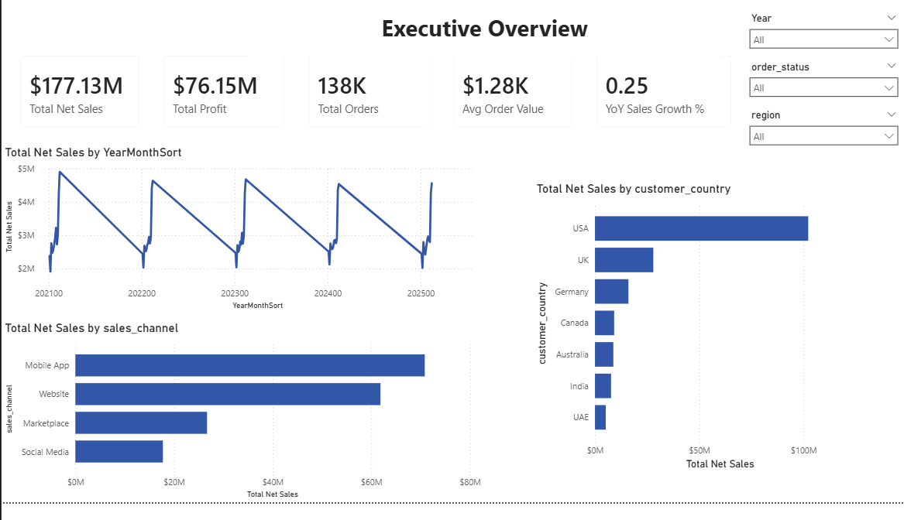
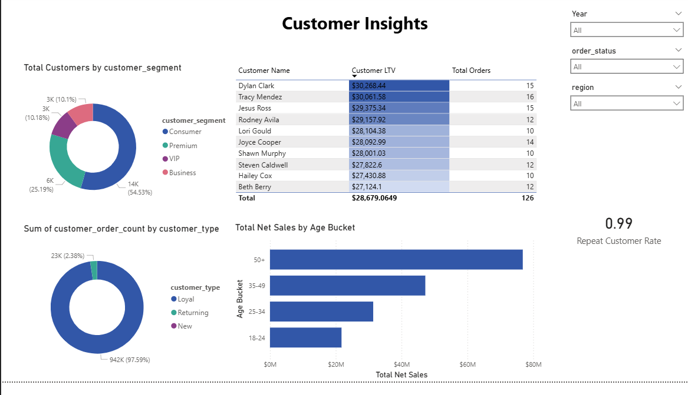
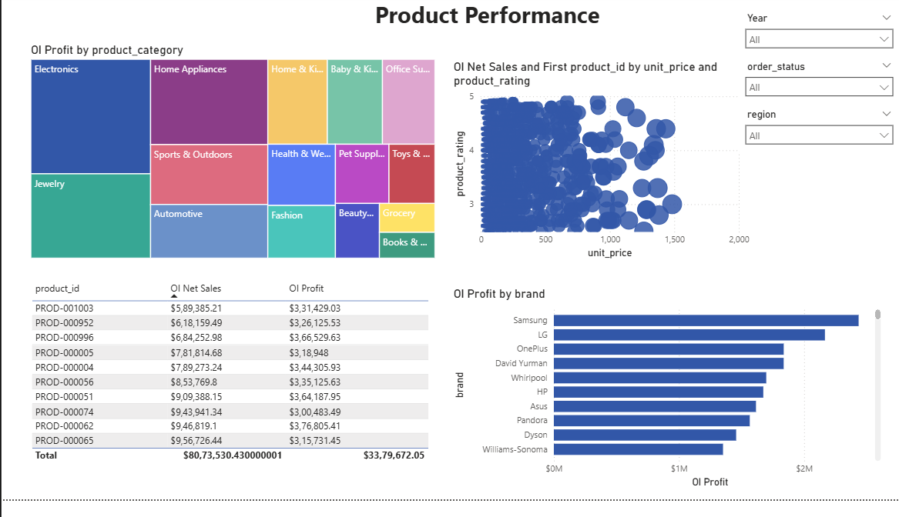
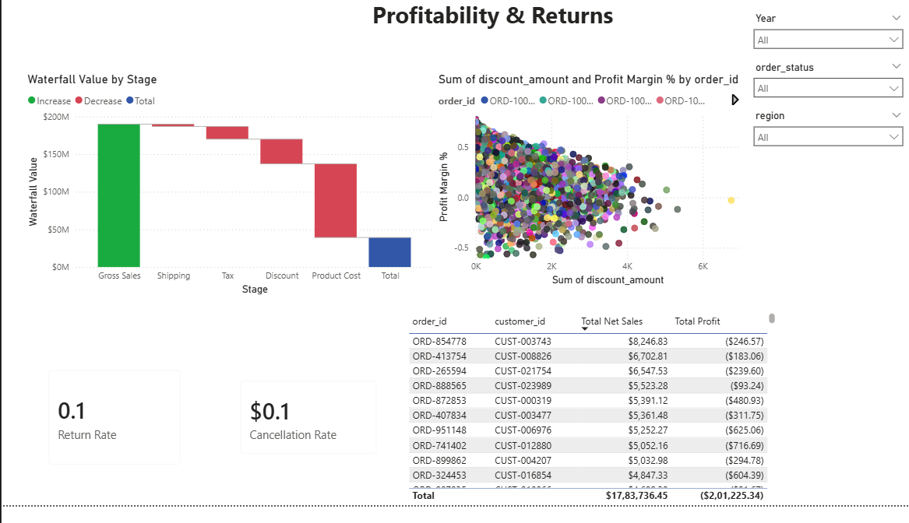

# E-Commerce Sales & Customer Analytics — Power BI

A 7-page Power BI dashboard built on five years of e-commerce transaction data — 138,116 orders,
397,569 line items, 24,911 customers and 1,175 products — modeled as a proper star schema with
22 DAX measures behind it. Built to demonstrate end-to-end analyst work: data modeling, DAX,
and dashboard design, not just a chart on top of a spreadsheet.



> **The data is synthetic**, generated for practice/portfolio use — names, addresses and reviews
> are Faker-style, and geography is deliberately scrambled (`Laurenland, Dubai, UAE`). No real
> customer data is involved.

## Report pages

| Page | What it answers |
| --- | --- |
| Overview | Cover page — report scope, FY2021–FY2025 |
| **Executive Overview** | Net sales, profit, orders, AOV and YoY growth at a glance; sales trend, top countries, channel mix |
| **Customer Insights** | Segment mix, customer LTV leaderboard, repeat-purchase rate, sales by age bracket |
| **Product Performance** | Category profit treemap, price vs. rating, top products by net sales, profit by brand |
| **Profitability & Returns** | Gross-to-net profit waterfall, discount vs. margin, return/cancellation rate, biggest-loss orders |
| Delivery & Logistics | Delivery time vs. estimate, on-time rate by warehouse/shipping method |
| Marketing & Campaigns | Channel & campaign attribution, coupon usage, loyalty point activity |

<details>
<summary><b>Screenshot gallery</b> — Customer Insights, Product Performance, Profitability & Returns</summary>
<br>

**Customer Insights**


**Product Performance**


**Profitability & Returns**


</details>

## Headline figures

| Metric | Value |
| --- | --- |
| Date range | 2021-01-01 → 2025-12-31 |
| Total revenue | $177,134,263.74 |
| Total profit | $76,146,395.76 |
| Average order value | $1,282.50 |
| Average customer rating | 3.68 |
| Return rate | 6.85% |
| Cancellation rate | 6.08% |

Source: [`dataset_statistics.csv`](dataset_statistics.csv).

## Skills demonstrated

- **Data modeling** — star schema (fact `order_items` + dimensions `customer_master`,
  `product_catalog`), plus a denormalized flat table for comparison; documented cardinality and
  known outer-join cases (89 customers with zero orders).
- **DAX** — 22 measures covering YTD/YoY growth, repeat customer rate, average order value,
  profit margin %, return and cancellation rate, and customer lifetime value.
- **Data quality awareness** — identified and documented real issues in the source data
  (inconsistent geography, floating-point noise, precomputed vs. recomputed margin) rather than
  papering over them — see [Caveats](#caveats).
- **Dashboard design** — 7 purpose-built pages (executive summary, customer, product,
  profitability, logistics, marketing) instead of one overloaded page; consistent KPI-card +
  chart layout; cross-page slicers (Year, order status, region).
- **Visual variety** — KPI cards, waterfall (gross-to-net profit bridge), treemap (category
  profit), scatter (price vs. rating, discount vs. margin), donut and bar breakdowns, ranked
  tables.

## Files

| File | Size | Rows | Role |
| --- | --- | --- | --- |
| `Ecommerce-Sales-Analytics.pbix` | 31.7 MB | — | The Power BI report |
| `ecommerce_sales_customer_analytics_150k.csv` | 48.7 MB | 138,116 | Denormalized order-level fact table (46 columns) |
| `order_items.csv` | 37.5 MB | 397,569 | Order line items — the grain below `order_id` |
| `customer_master.csv` | 2.2 MB | 25,000 | Customer dimension |
| `product_catalog.csv` | 155 KB | 1,175 | Product dimension |
| `dataset_statistics.csv` | 284 B | 1 | Precomputed summary of the whole dataset |

All CSVs and the `.pbix` are stored with [Git LFS](#working-with-this-repo).

## Data model

Two usable shapes ship in the same repo, and they overlap:

```
                 ┌──────────────────────┐
                 │  customer_master     │  25,000 customers
                 │  PK customer_id      │
                 └──────────┬───────────┘
                            │
                            │  customer_id
                            ▼
  ┌────────────────────────────────────────────────────┐
  │  ecommerce_sales_customer_analytics_150k           │
  │  PK order_id · 138,116 orders · one row per order  │
  │  (customer + product attributes already flattened) │
  └──────────┬─────────────────────────────────────────┘
             │  order_id
             ▼
  ┌──────────────────────┐        product_id      ┌──────────────────────┐
  │  order_items         │───────────────────────▶│  product_catalog     │
  │  397,569 line items  │                        │  PK product_id       │
  └──────────────────────┘                        │  1,175 products      │
                                                  └──────────────────────┘
```

- **Star schema** — `order_items` as the fact table, joined to `customer_master` (via the order
  header) and `product_catalog`. Use this for anything product- or basket-level.
- **Flat table** — `ecommerce_sales_customer_analytics_150k.csv` carries order, customer,
  fulfillment, marketing and review attributes on one row. Convenient for quick exploration, but
  it has no product grain: quantity and sales are order totals.

Note the two sources double-count if you load both and sum naively. `order_items` sums to the
order totals in the flat file, so pick one grain per measure.

`customer_master` holds 25,000 rows while only 24,911 customers ever place an order — 89
customers exist with no purchase history, which is intentional and useful for testing outer joins
and "customers with no orders" measures.

### Column reference

<details>
<summary><code>customer_master.csv</code> — 11 columns</summary>

`customer_id` · `customer_name` · `customer_age` · `gender` · `customer_segment` ·
`customer_city` · `customer_state` · `customer_country` · `region` · `customer_postal_code` ·
`customer_acquisition_cost`

Segments: Consumer (13,638) · Premium (6,301) · VIP (2,542) · Business (2,519)
Regions: South · Central · West · East · North
Countries: USA (14,925) · UK (3,701) · Germany (2,046) · Canada (1,279) · Australia (1,233) ·
India (1,041) · UAE (775)

</details>

<details>
<summary><code>product_catalog.csv</code> — 9 columns</summary>

`product_id` · `product_name` · `product_category` · `product_subcategory` · `brand` ·
`supplier` · `unit_price` · `product_cost` · `product_rating`

15 categories, fairly evenly weighted: Sports & Outdoors, Books & Media, Health & Wellness,
Beauty & Personal Care, Automotive, Office Supplies, Grocery, Electronics, Home Appliances,
Toys & Games, Baby & Kids, Pet Supplies, Home & Kitchen, Jewelry, Fashion.

~145 brands across 10 suppliers (Alibaba, Amazon Supply, Asian Manufacturing, Direct Import,
Domestic Producers, Euro Logistics, Global Trade, MultiSource, North American Supply,
Pacific Trade).

</details>

<details>
<summary><code>order_items.csv</code> — 12 columns</summary>

`order_id` · `product_id` · `quantity` · `unit_price` · `discount_percentage` ·
`discount_amount` · `gross_sales` · `tax_amount` · `shipping_cost` · `net_sales` ·
`product_cost` · `profit`

Grain: one row per product per order (~2.9 items per order).

</details>

<details>
<summary><code>ecommerce_sales_customer_analytics_150k.csv</code> — 46 columns</summary>

**Order** — `order_id` · `order_date` · `order_time` · `order_status` · `sales_channel`

**Customer** — `customer_id` · `customer_name` · `customer_age` · `gender` ·
`customer_segment` · `customer_type` · `customer_city` · `customer_state` ·
`customer_country` · `region` · `customer_postal_code`

**Payment** — `payment_method` · `payment_status` · `currency`

**Fulfillment** — `shipping_method` · `warehouse` · `delivery_days` ·
`estimated_delivery_days` · `delivery_status` · `return_status` · `return_reason`

**Voice of customer** — `customer_rating` · `review_sentiment` · `customer_review`

**Marketing** — `marketing_channel` · `campaign_name` · `coupon_code` ·
`loyalty_points_earned` · `loyalty_points_redeemed`

**Financials** — `quantity` · `gross_sales` · `discount_amount` · `tax_amount` ·
`shipping_cost` · `net_sales` · `product_cost` · `profit` · `profit_margin_percentage`

**Derived** — `customer_lifetime_value` · `is_repeat_customer` · `customer_order_count`

`return_reason` and `coupon_code` are empty for the majority of rows, by design.

</details>

## Working with this repo

The data files are tracked with Git LFS, so install it before cloning or the CSVs will arrive as
small pointer text files:

```bash
git lfs install
git clone <repo-url>
```

If you cloned before installing LFS, run `git lfs pull` to fetch the real contents.

Open `Ecommerce-Sales-Analytics.pbix` in [Power BI Desktop](https://powerbi.microsoft.com/desktop/). If the report
prompts for a data source path, point it at your local clone directory — the queries reference
the CSVs sitting alongside the `.pbix`.

## Caveats

- Geography is internally inconsistent (city, state and country are drawn independently), so
  map visuals will look wrong. Treat the location columns as categorical labels, not coordinates.
- `discount_percentage` in `order_items.csv` is a raw float (`0.3396…`), not a rounded percentage.
- Floating-point noise is present throughout (`12.030000000000001`); round at the measure level.
- The flat file's `profit_margin_percentage` is precomputed per order — recompute it rather than
  averaging it when aggregating.
